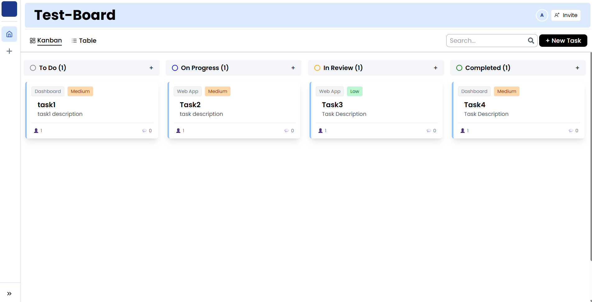
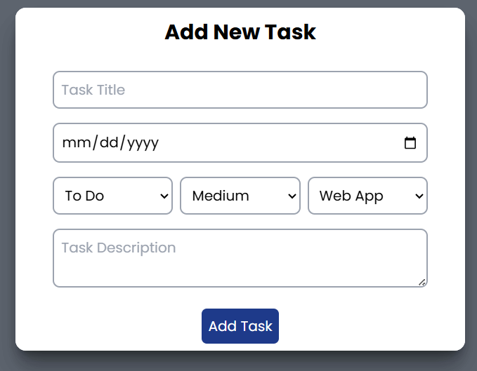
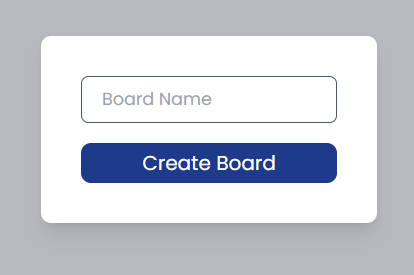

# 📝 Taskora



[](LICENSE)
[](#)

> **KanbanBoard** is a full-stack, modern, and interactive Kanban board application for task and project management. Built with React, Node.js, and MongoDB, it offers a seamless experience for teams and individuals to organize, track, and manage their work efficiently.

---

## 🚀 Features
<details>
  <summary>Click to expand</summary>

- 🏷️ Create, edit, and delete boards, columns, tasks, and subtasks
- 👥 User authentication & role-based access
- 🗂️ Drag-and-drop task management
- 🔍 Powerful search functionality
- 📱 Responsive design (desktop & mobile)
- 🌙 Dark mode support
- 📊 analytics (coming soon)
</details>

---

## 🖼️ Screenshots

| Dashboard | Add Task | Create Boards |
|-----------|----------|--------------|
|  |  |  |

---

## 🛠️ Tech Stack

- **Frontend:** React, Redux, Tailwind CSS, Vite
- **Backend:** Node.js, Express.js, MongoDB
- **Other:** JWT Auth, REST API, Axios, ESLint, PostCSS

---

## ⚡ Quick Start

### 1. Clone the repository
```bash
git clone https://github.com/your-username/KanbanBoard.git
cd KanbanBoard
```

### 2. Setup Backend
```bash
cd backend
npm install
# Configure your MongoDB URI in src/config/database.js or via environment variables
npm start
```

### 3. Setup Frontend
```bash
cd ../frontend
npm install
npm run dev
```

> The frontend will run on [http://localhost:5173](http://localhost:5173) and backend on [http://localhost:5000](http://localhost:5000) by default.

---

## 📚 Usage

- Register or login to your account
- Create a new board and add columns (e.g., To Do, In Progress, Done)
- Add tasks and subtasks, assign users, set priorities
- Drag and drop tasks between columns

---

## 🤝 Contributing

We welcome contributions !

1. Fork the repo
2. Create your feature branch (`git checkout -b feature/YourFeature`)
3. Commit your changes (`git commit -m 'Add some feature'`)
4. Push to the branch (`git push origin feature/YourFeature`)
5. Open a Pull Request

---

## 🌐 Live Demo

[Live Demo](https://taskora-three.vercel.app/)

---

## 📄 License

This project is licensed under the MIT License - see the [LICENSE](LICENSE) file for details.
